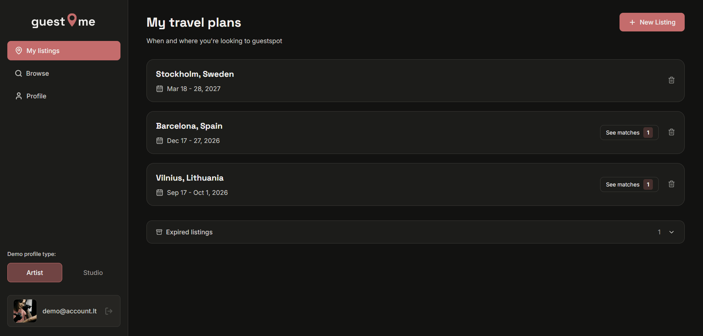

# GuestMe

A guest spotting platform for European tattoo artists and studios.

🔗 **Live app:** [guestme.eu](https://guestme.eu/)
🔗 **Demo version:** [guestme-demo.netlify.app](https://guestme-demo.netlify.app/)

## About

GuestMe helps tattoo artists find studios with open guest spots, and helps studios find artists who are looking to travel and guest spot in their area.

Both artists and studios can create listings that appear in the opposite user type's browse tab:

- **Artists** specify where and when they'll be travelling.
- **Studios** specify where and when they have an open guest spot.
  Each listing includes a link to the other user's Instagram, making it easy to connect and arrange details directly.

## Tech Stack

- **React** — frontend framework
- **Vite** — build tool
- **Firebase** — Firestore (database), Auth (authentication), Storage (image uploads)
- **Netlify** — demo version deployment
- **Hostinger** — production version deployment

## Features

- Separate artist and studio profile types
- Browse listings with city and date-range filtering
- Create, view, and manage travel plans / open spot listings
- Match indicators when a listing overlaps with a relevant opposite-type listing
- Portfolio image galleries on artist/studio profiles
- Email verification and onboarding flow for new users
- Demo mode with seeded accounts for easy exploration without signing up

## Challenges & What I Learned

- Working with Firebase (Firestore, Auth, Storage) for the first time
- Structuring the project to stay organized as features grew
- Using environment variables to spin up a separate demo version alongside the live app
- Designing a smooth onboarding flow for new users
- Handling email verification end-to-end
- Handling empty section, image, page states

## What I'd Improve With More Time

- Add an in-app chat feature so users aren't reliant on Instagram for communication
- Notify users via email when their listing receives matches
- Expand and polish the public-facing side of the site (the home page is currently fairly minimal)

## Screenshots

